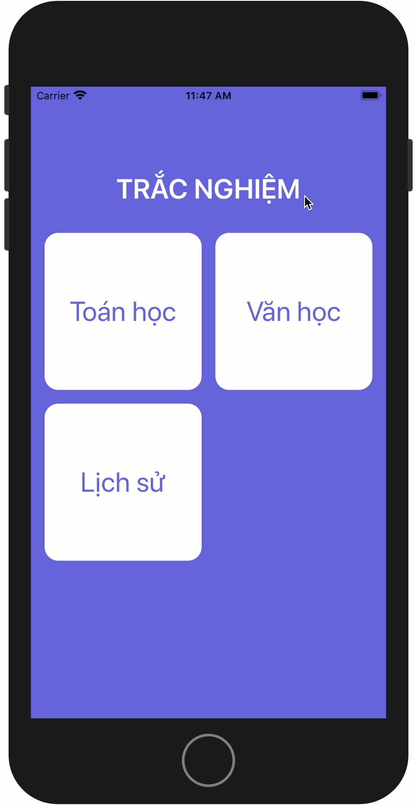
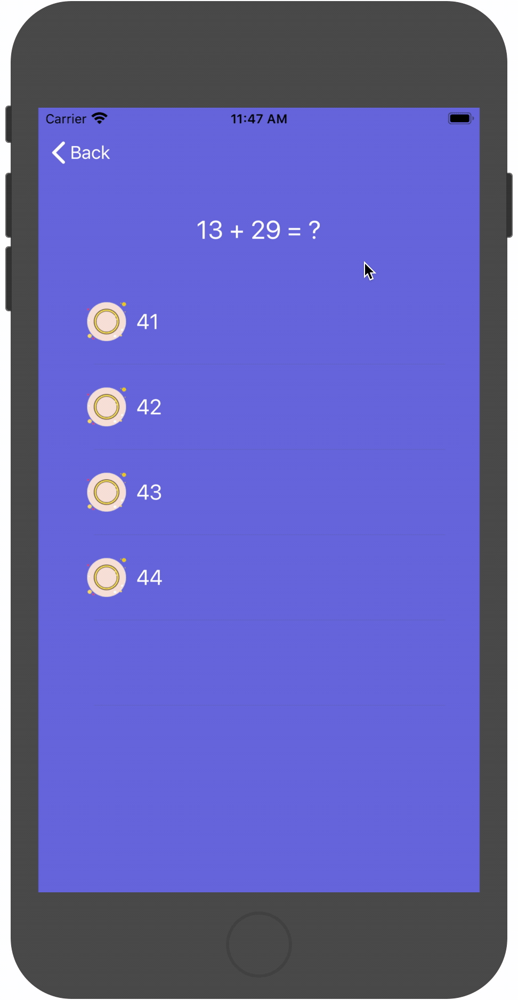
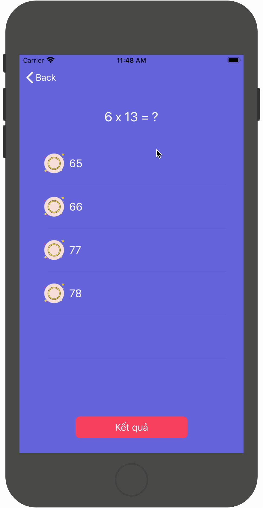

#  Quiz App
## Mô tả
Cái tên nói lên tất cả. 1 App nhỏ về chủ đề câu hỏi trắc nghiệm.
App có 3 màn hình:
- Lựa chọn loại câu hỏi.
- Trả lời câu hỏi.
- Kết quả.
## Component sử dụng
- UICollectionView
- UITableView
- UINavigationController
- UIGesture...
 
 

